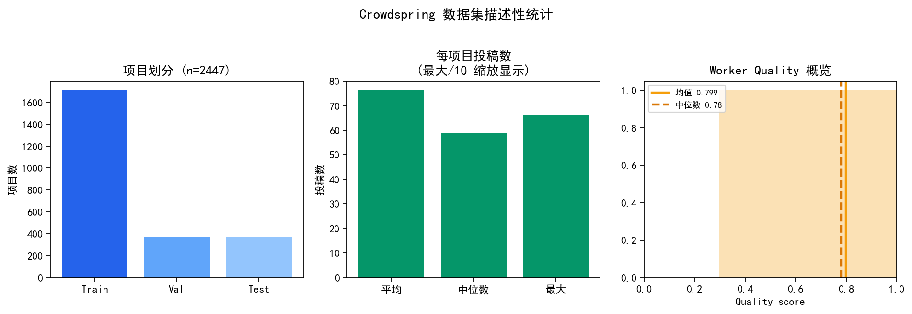
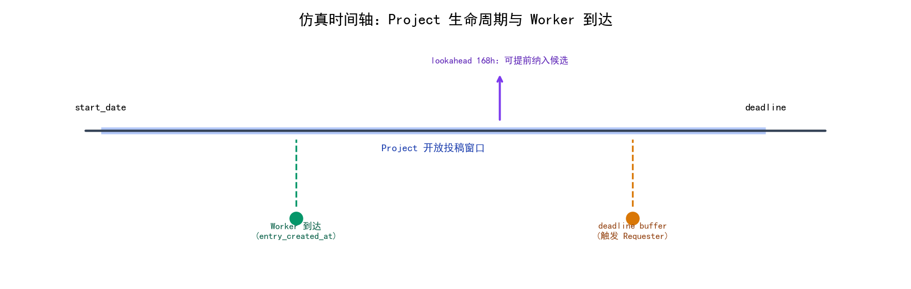
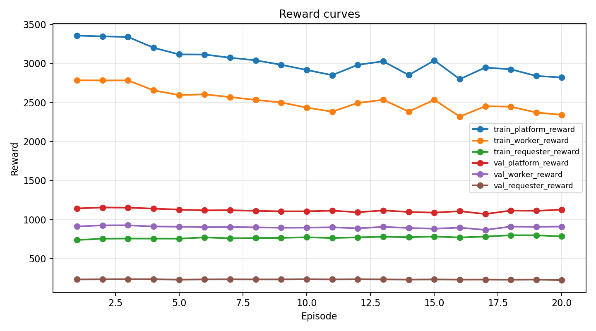
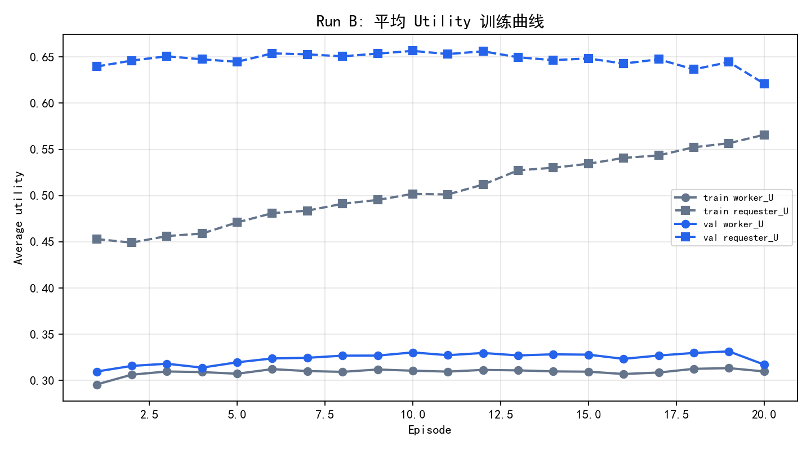
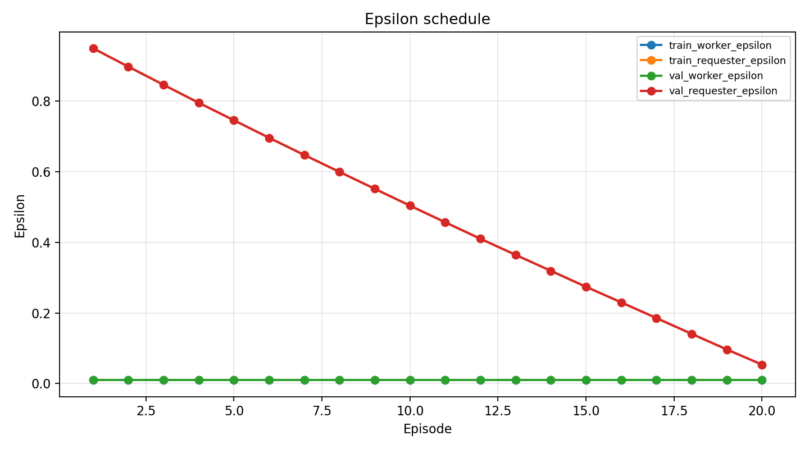
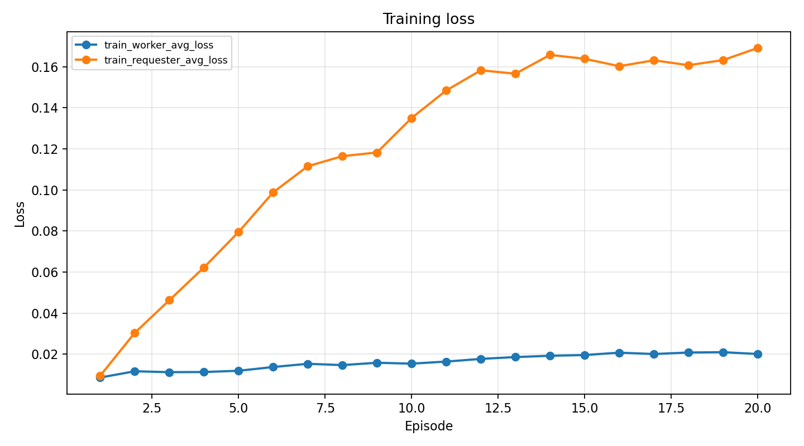
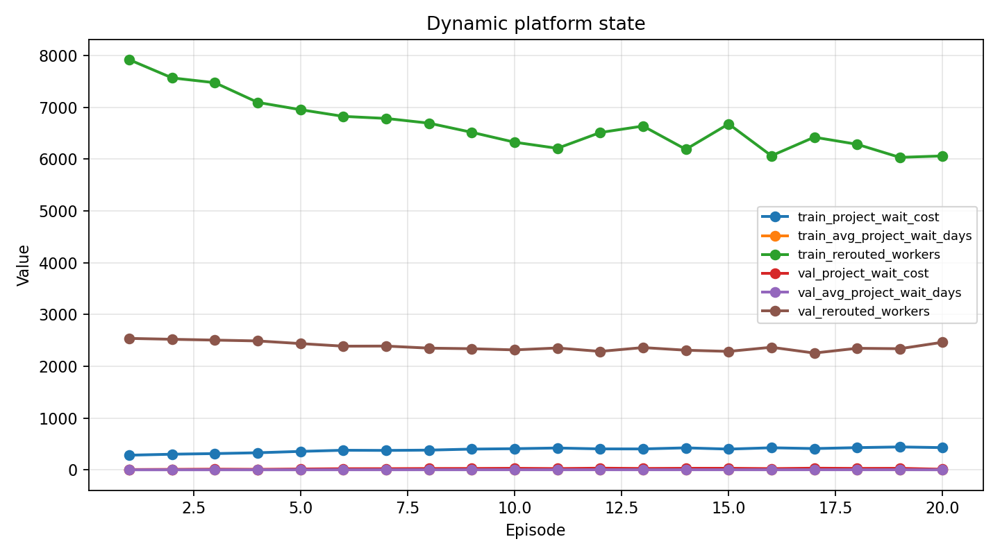
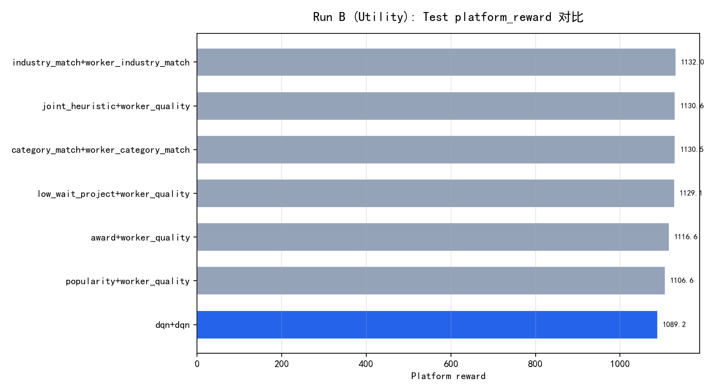
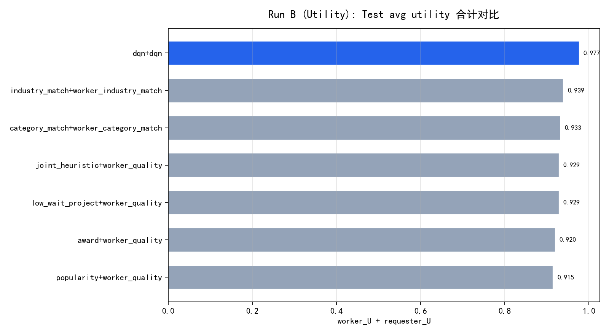

# 基于 DQN 的动态双边众包任务推荐实验报告

> **课程**：强化学习大作业
>
> **题目**：将 DQN 系列模型应用于众包任务推荐，分别最大化参与者（Worker）与请求者（Requester）利益
>
> **代码仓库**：`DQN_CrowdRec`
>
> **实验目录**：`report_full_platform_utility_full`
>
> **报告日期**：2026 年 6 月

---

## 摘要

本文基于 Crowdspring 历史众包日志，将众包任务推荐建模为一个动态双边平台决策问题,与只做静态候选排序的推荐任务相比，该建模显式描述了参与者到达、项目等待、申请池变化、项目关闭和 worker 回流等动态过程。

本文实现了两个异步协同的 DQN 智能体：Worker-DQN 负责给当前 worker 选择 project，Requester-DQN 负责为当前 project 选择 winner 或等待。正式实验以 utility reward 驱动的 Dueling Double DQN 为主要方法，并在 test 集上与 popularity、category match、industry match、award、low wait、joint heuristic 等启发式策略进行比较。

## 1 背景与问题描述

### 1.1 背景

众包模型从开放、快速变化的参与者群体中获取服务：平台通过互联网吸引 Worker，将任务划分后等待完成并聚合结果。商用系统如 Amazon MTurk 中，Requester 发布任务并设定报酬，Worker 进入平台后浏览任务列表（标题、描述、创建时间、结束时间等），自主选择任务并完成。

### 1.2 问题简化与目标

本实验在简化设定下研究：

- 平台每次**只向 Worker 推荐 1 个任务**
- Requester 在收到足够申请后，从申请池**选 1 名 Worker 为 winner**，或选择 **WAIT** 继续等待
- 系统为盈利性平台，需同时兼顾：
  - **参与者**：找到更相关、感兴趣、报酬更高的任务
  - **请求者**：任务获得更多、更高质量的回答

#### 1.2.1 问题定义

本文研究的是一个动态双边匹配问题：平台需要在 worker 持续到达、project 按时发布并受 deadline 约束的条件下，同时决定“把哪个 project 推荐给当前 worker”以及“requester 何时从申请池中选出 winner”。这两个决策共享同一平台状态：worker 的申请会改变 project 的候选池，requester 的等待或选人又会改变后续 worker 可参与的任务集合。

给定历史日志中的 `project`、`worker`、`entry` 和 `winner` 信息，本文构建离线仿真环境，将一次平台运行抽象为如下过程：

1. `project` 按 `start_date` 发布，并在 `deadline` 前保持开放。
2. `worker` 按 `entry_created_at` 到达平台。
3. 平台为当前 `worker` 推荐一个开放 `project`。
4. `worker` 被推荐给 `project` 后进入该 `project` 的申请池。
5. 当申请池满足 `batch` 条件或接近 `deadline` 时，`requester` 决定继续等待或选择某个 `worker`。
6. `project` 关闭后，`winner` 离开流程，未中标 `worker` 释放并可继续参与后续推荐。

因此，本文的优化目标不是单纯提升某一个静态 `hit rate`，而是在完整时间流程中平衡三类收益：worker 是否获得更合适、更有价值的 project，requester 是否获得更高质量、更匹配的 winner，以及 project 是否因为过度等待而产生额外成本。

| 子任务 | 强化学习角色 | 优化目标 |
| --- | --- | --- |
| （1）最大化参与者利益 | Worker-DQN | 推荐 Worker 更可能感兴趣、收益更高的 Project |
| （2）最大化请求者利益 | Requester-DQN | 从申请池选出高质量、高匹配 Worker，并平衡等待成本 |

---

### 1.4 本文工作

本文完成了以下工作：

1. 构建基于 Crowdspring 历史日志的动态双边平台仿真环境。
2. 将 worker 推荐和 requester 选人分别建模为两个候选集打分式 DQN 问题。
3. 使用 Dueling Double DQN 训练 Worker-DQN 与 Requester-DQN。
4. 设计 utility reward，将奖金、匹配、技能、竞争、质量、预期得分、活跃度等 proxy 纳入奖励。
5. 与多组启发式基线进行 test 集对比。
6. 对实验效果不佳的原因进行客观分析，避免只依据单一累计 reward 得出过度结论。

## 2 数据与事件构造

### 2.1 数据来源

Crowdspring 脱敏日志，主要文件：

| 文件 | 关键字段 | 用途 |
| --- | --- | --- |
| `project/project_*.txt` | `start_date` , `deadline` , `category` , `industry` , `total_awards` , `average_score` | 任务静态/动态特征 |
| `entry/entry_*.txt` | `author` , `entry_created_at` , `max_revision_score` , `winner` , `finalist` | Worker 到达事件、完成 outcome |
| `worker_quality.csv` | `worker_id` , `quality` | Requester 侧 worker 质量先验 |

### 2.2 全量规模

| 指标 | 数值 |
| --- | --- |
| 项目总数 | 2447 |
| 投稿条目 | 186605（非撤回 116274） |
| 有投稿 Worker | 1753 |
| 有质量分 Worker | 1653 |
| 行业数 | 37 |
| Train / Val / Test 项目 | 1712 / 367 / 368 |
| 时间范围 | start: 2018-01 ~ 2019-02；deadline: 2018-01 ~ 2019-03 |
| 平均投稿数 / 项目 | 76.3（中位数 59） |
| 平均奖金 | 285.5（中位数 200） |
| 平均项目周期 | 9.3 天（中位数 7 天） |
| Worker quality 均值 | 0.799 |

**图 1** 对上述规模的直观汇总（项目划分、投稿分布、Worker 质量）。



*图1 数据集描述性统计*

> **图 1 说明**：左图为 Train/Val/Test 按 `start_date` 时序切分的项目数（1712/367/368）；中图为每项目投稿数的均值、中位数及最大值（最大 661，图中除以 10 缩放以便同轴展示）；右图为 Worker quality 的均值（0.799）与中位数（0.78）。

### 2.3 时间推进机制

平台时间按真实事件顺序推进。Project 进入可选集合后等待 worker 申请，worker 到达后选择 project；当申请池积累到足够信息或临近 deadline 时，requester 决定继续等待或选出 winner。

这一机制把“申请、等待、选人、回流”放在同一条时间线上，使任一方动作都会改变后续平台状态。仿真时间线如图 2 所示。



*图2 仿真时间轴示意图*

## 3 方法：MDP 形式化

### 3.1 总体架构

本文将众包平台建模为一个共享平台状态上的异步双智能体 MDP。Worker-DQN 表示参与者侧策略，Requester-DQN 表示请求者侧策略，二者不独立运行，而是在同一平台状态上交替作出决策。

```
PlatformSimulationEnv（共享平台状态）
    ├── Worker-DQN：选 Project（K=32 槽位）
    └── Requester-DQN：选 Worker 或 WAIT（K=32+1 槽位）
```

形式上，将平台写作：

$$
M = (S, A, P, R, \gamma)
$$

其中，$S_t$ 表示 $t$ 时刻的平台状态，包含开放 project 集合、申请池、已关闭 project、worker 到达队列、等待时间、winner 状态和可回流 worker。$A_t$ 是当前被调度智能体的动作。$P$ 表示由推荐、等待、选人、关闭和回流共同决定的状态转移。$R$ 表示即时奖励。$\gamma$ 为折扣因子。

完整状态 $S_t$ 并不直接作为策略输入。两个智能体实际观察到的是 $S_t$ 的局部投影：

$$
o^W_t = \bigl(x_w(t), X^P_t, m^W_t\bigr), \qquad
o^R_t = \bigl(x_p(t), X^W_t, m^R_t\bigr)
$$

这里 $x$ 表示当前决策主体的 anchor 特征，$X$ 表示候选集合，$m$ 表示可行动作集合。一个智能体的动作会通过共享状态改变另一方之后看到的候选集，因此该问题本质上是耦合的动态决策过程，而不是两个彼此独立的推荐任务。

---

### 3.2 参与者与请求者的状态、行为、奖励

两个智能体的建模都由三部分组成：局部状态、动作集合和即时效用。Worker 侧描述当前 worker 申请哪个 project，Requester 侧描述当前 project 是否继续等待，或从申请池中选出 winner。

#### 3.2.1 参与者（Worker）

Worker-DQN 在时刻 $t$ 观察当前 worker 及其候选 project 集合：

$$
o^W_t = \bigl(x_w(t), X^P_t, m^W_t\bigr)
$$

其动作是在合法 project 候选中选择一个申请目标：

$$
a^W_t \in A^W_t = \{1,\ldots,K_P\}
$$

| 要素 | 定义 |
| --- | --- |
| **状态 $s^W$** | 当前 worker 表征、project 候选集合和可行动作集合 |
| **行为 $a^W$** | 从候选 project 中选择一个申请目标 |
| **奖励 $r^W$** | 由 worker 对 project 的综合效用 $U^W$ 给出 |
| **无效动作** | 不属于 $A^W_t$ 的 project 不参与决策 |

Worker 侧效用刻画 project 对当前 worker 的吸引力：

$$
U^W(w,p)
= \alpha_{\mathrm{award}} A(p)+ \alpha_{\mathrm{match}} M(w,p)+ \alpha_{\mathrm{skill}} S(w,p)- \alpha_{\mathrm{comp}} C(p)
$$

- $A(p)$ 表示 project 奖金吸引力。
- $M(w,p)$ 表示 worker 与 project 在类别和行业上的匹配程度。
- $S(w,p)$ 表示 worker 在相关任务上的历史能力。
- $C(p)$ 表示 project 当前竞争压力。
- $\alpha_{\mathrm{award}}$、$\alpha_{\mathrm{match}}$、$\alpha_{\mathrm{skill}}$ 和 $\alpha_{\mathrm{comp}}$ 表示各效用项的相对权重。

#### 3.2.2 请求者（Requester）

Requester-DQN 在 project 的申请池形成后作出选择。其局部状态包含 project 上下文、申请池内 worker 候选集合和可行动作集合：

$$
o^R_t = \bigl(x_p(t), X^W_t, m^R_t\bigr)
$$

Requester 的动作集合由等待动作和 worker 选择动作共同组成：

$$
a^R_t \in A^R_t = \{\mathrm{WAIT},1,\ldots,K_W\}
$$

| 要素 | 定义 |
| --- | --- |
| **状态 $s^R$** | 当前 project 表征、申请池 worker 候选集合和可行动作集合 |
| **行为 $a^R$** | $\mathrm{WAIT}$ 或从申请池 worker 中选择 winner |
| **Agent 奖励** | $r^R = U^R - C_{\mathrm{wait}}$ |
| **触发条件** | 由申请池规模、剩余时间和 deadline 约束共同决定 |

Requester 侧效用刻画某个 worker 作为 winner 的预期质量：

$$
U^R(p,w) = \beta_{\mathrm{quality}} Q(w) + \beta_{\mathrm{score}} E(p,w) + \beta_{\mathrm{match}} M(p,w) + \beta_{\mathrm{activity}} H(w)
$$

$$
r^R = U^R - C_{\mathrm{wait}}
$$

- $Q(w)$ 表示 worker 的历史质量。
- $E(p,w)$ 表示 worker 在当前 project 上的预期得分。
- $M(p,w)$ 表示 worker 与 project 的偏好匹配程度。
- $H(w)$ 表示 worker 的历史活跃度。
- $\beta_{\mathrm{quality}}$、$\beta_{\mathrm{score}}$、$\beta_{\mathrm{match}}$ 和 $\beta_{\mathrm{activity}}$ 表示各效用项的相对权重。

Requester 的奖励写作 $r^R = U^R - C_{\mathrm{wait}}$，是因为 requester 不只关心最终 winner 的质量，也承担等待带来的机会成本。若继续等待可以带来更高质量的申请者，$U^R$ 可能上升；但等待时间越长，project 完成越晚，平台与 requester 的成本也越高。因此，减去 $C_{\mathrm{wait}}$ 可以把“选得更好”和“不要无意义拖延”放在同一个优化目标中。

$\mathrm{WAIT}$ 动作不会立即关闭 project，但会提高等待成本 $C_{\mathrm{wait}}$；选人动作则产生 winner 并使 project 进入关闭状态。

---

### 3.3 当前状态与下一步状态

平台的完整状态可写为：

$$
S_t =
\bigl(P^{\mathrm{open}}_t, B_t, P^{\mathrm{closed}}_t, W^{\mathrm{avail}}_t, \tau_t\bigr)
$$

其中 $P^{\mathrm{open}}_t$ 是开放 project 集合，$B_t$ 是各 project 的申请池，$P^{\mathrm{closed}}_t$ 是已关闭 project，$W^{\mathrm{avail}}_t$ 是可参与后续匹配的 worker，$\tau_t$ 表示平台时间。

一次状态转移由当前动作和外生到达事件共同决定：

$$
S_{t+1} = T(S_t, a_t, e_t)
$$

当 $a_t$ 是 worker 的申请动作时，转移主要改变相应 project 的申请池；当 $a_t$ 是 requester 的 $\mathrm{WAIT}$ 动作时，转移主要增加等待成本并保持 project 开放；当 $a_t$ 是选人动作时，转移生成 winner、关闭 project，并释放未中选 worker。

因此，下一状态并不是单个智能体的局部后继，而是共享平台状态的后继。两个智能体在各自下一次被调度时，再从新的 $S_{t+1}$ 中获得对应的局部观测。

---

### 3.4 Q 函数构造

#### 3.4.1 结构：Anchor–Candidate 双塔

由于每一步可选 project 或 worker 都不同，动作不能被理解为固定 ID，而应理解为当前候选集中的一个元素。Q 函数因此定义在“当前主体 anchor 与候选对象 candidate”的组合上。

$$
Q_W(o^W_t, a_i) = q_W\bigl(x_w(t), x^P_i(t)\bigr)
$$

$$
Q_R(o^R_t, a_i) = q_R\bigl(x_p(t), x^W_i(t)\bigr)
$$

该形式把候选排序问题转化为候选集上的效用估计：每个候选都有自己的 $Q$ 值，最终动作是在合法候选集合中选取 $Q$ 值最大的元素。

#### 3.4.2 Dueling 分解

Dueling 形式把状态价值和动作相对优势分开表达：

$$
Q(s,a)=V(s)+\left(A(s,a)-\frac{1}{|\mathcal{A}(s)|}\sum_{a' \in \mathcal{A}(s)}A(s,a')\right)
$$

其中 $V(s)$ 衡量当前平台局部状态本身的价值，$A(s,a)$ 衡量候选动作 $a$ 相对于同一状态下其他可行动作的增量价值。括号中的均值校正项用于消除 advantage 的任意平移，使 $Q(s,a)$ 的分解更加稳定。

#### 3.4.3 Double DQN 目标

动作价值遵循 Bellman 形式的递推关系。对一次转移 $(s,a,r,s')$，目标值写作：

$$
a^* = \arg\max_{a' \in \mathcal{A}(s')} Q(s',a')
$$

$$
y = r + \gamma Q^{-}(s',a^*)
$$

该目标表达了当前即时效用与未来最优候选价值之间的折中。$\gamma$ 越大，模型越重视后续平台状态带来的长期收益。

#### 3.4.4 动作掩码

动作掩码在建模上定义了当前时刻的可行动作集合：

$$
A_t = \{a \mid m_t(a)=1\}
$$

策略选择只在 $A_t$ 内进行。对 Worker 来说，非法动作包括不可申请或已关闭的 project；对 Requester 来说，非法动作包括空申请池 worker，以及 deadline 约束下不可继续等待的 $\mathrm{WAIT}$。

---

### 3.5 特征构造

特征构造服务于局部观测 $o_t$ 的定义，所有特征只使用决策时刻 $t$ 之前可观测的历史，避免未来信息泄漏。连续长尾变量主要使用 `log1p` 缩放。

$$
\phi(\cdot,t) = f(\text{history before }t)
$$

| 模块 | 维度 | 具体特征 |
| --- | ---: | --- |
| Worker 特征 $x_w(t)$ / Requester 候选 Worker 特征 $x_i^W(t)$ | 12 | `worker_quality`；`log1p(past_count)`；`mean_score / 5`；`win_rate`；`finalist_rate`；`dominant_category / 20`；`dominant_industry / industry_vocab_size`；`dominant_category_share`；`dominant_industry_share`；`log1p(gap_hours) / 10`；`log1p(recent_30d_count) / 5`；`log1p(past_count) / 10` |
| Worker 侧 Project 候选特征 $x_i^P(t)$ | 14 | `category / 20`；`sub_category / 60`；`industry_id / industry_vocab_size`；`log1p(entry_count)`；`log1p(total_awards)`；`average_score / 5`；`featured`；`log1p(hours_left) / 10`；`log1p(hours_open) / 10`；`category_match`；`industry_match`；`fill_ratio`；`remaining_ratio`；`log1p(wait_days)` |
| Requester 上下文特征 $x_p(t)$ | 17 | `category / 20`；`sub_category / 60`；`industry_id / industry_vocab_size`；`log1p(entry_count)`；`log1p(total_awards)`；`average_score / 5`；`featured`；`log1p(hours_left) / 10`；`log1p(hours_open) / 10`；`fill_ratio`；`remaining_ratio`；`log1p(wait_days)`；`log1p(applicant_count) / 5`；`pool_mean_q`；`pool_max_q`；`pool_std_q`；`pool_top_gap` |

动作掩码不计入上述特征维度：Worker-DQN 的 $m^W_t$ 对应 32 个 project 槽位，Requester-DQN 的 $m^R_t$ 对应 1 个 WAIT 槽位和 32 个 worker 槽位。

## 4 实验流程与设计

### 4.1 实验环境

| 项 | 配置 |
| --- | --- |
| 硬件 | NVIDIA GPU（ `device=cuda` ） |
| 框架 | PyTorch |
| 模型 | Dueling Double DQN（Worker + Requester 各一） |
| 候选数 K | Project=32，Worker=32 |
| `include_truth_in_candidates` | **False** （更贴近真实推荐） |
| Episodes | 20 |
| `max_steps_per_episode` | 0（完整 episode，不截断） |

### 4.2 训练流程

**目录**：`report_full_platform_utility_full/`

**Run 标识**：`platform_dqn_utility_no_truth_mixed`

**训练时长**：约 25 分钟 / 20 ep

```bash
# 1. BC 预训练（各 8 ep，全量）
python scripts/pretrained_platform_bc.py --side worker  --max-projects 0 --max-steps 0 --episodes 8 --device cuda
python scripts/pretrained_platform_bc.py --side requester --max-projects 0 --max-steps 0 --episodes 8 --device cuda

# 2. Platform DQN（加载 BC best）
python scripts/train_platform_dqn.py \
  --max-projects 0 --episodes 20 --max-steps 0 --device cuda \
  --worker-pretrained .../worker_best.pt \
  --requester-pretrained .../requester_best.pt \
  --log-dir .../platform_dqn_full

# 3. Test 基线 + DQN 对比
python scripts/run_platform_baselines.py --split test --max-projects 0 --max-steps 0 \
  --output-dir .../platform_baselines_full
```

### 4.3 关键超参数

| 配置项 | 取值 |
| --- | --- |
| reward_mode | **utility** |
| requester_batch_size | 8 |
| requester_deadline_buffer_hours | 24 |
| project_lookahead_hours | 168 |
| mixed_recall | True |
| Worker / Requester 特征维 | 14 / 17（anchor） |
| replay buffer | 100000 / 50000 |
| min_batch_size | 16 / 8 |
| lr | 3e-4 |
| worker ε decay | 1000 步 |
| requester ε decay | 8000 步 |
| BC 预训练 | 有（各 8 ep） |

---

## 5 实验结果与分析

本次实验最关键的问题在于Platform DQN 学到了当前 utility proxy 下的局部偏好，尤其在 requester 侧效用上表现较好，但这种优势没有转化为更高的 `platform_reward`。主要原因是 worker 侧候选排序较弱、Requester-DQN 的等待/停止边界不稳定，导致等待成本和未填充 project 抵消了 utility 优势。

后续所有训练曲线、test 表格和图 3 至图 9 都围绕这一问题展开论证。

| 证据 | 关键数据 | 指向的问题 |
| --- | --- | --- |
| Utility proxy 表现 | DQN 的 `worker_U=0.323`、`req_U=0.654`，合计 0.977，全场最高 | DQN 确实学到 proxy 偏好 |
| 平台累计收益 | DQN `platform_reward=1089.2`，低于 industry_match 的 1132.0 | proxy 优势没有转化为平台收益 |
| Worker 侧结果 | DQN `worker_hit=5.56%`，低于所有启发式；但 `worker_recall_at_k=0.9392` | 主要问题在候选内排序，不在召回 |
| Requester 侧结果 | DQN `requester_reward=237.7` 最高，但 `wait=24.4` 远高于启发式的 0.2 到 0.8 | 选人效用较高，但等待控制不足 |
| Project 完成情况 | DQN `filled_rate=98.6%`，有 5 个 project 未填充；启发式均为 100% | 动态流程控制仍不稳定 |

表中可以看到一个很清楚的矛盾：DQN 在 utility proxy 上最优，但在平台运营指标上并不最优。因此，本章不把DQN 是否学习到东西和DQN 是否平台最优混为一谈。更准确的结论是：模型学到了当前 reward 鼓励的局部效用，但 reward 与平台目标之间仍存在错位。

### 5.2 训练过程：utility 上升，但平台收益没有同步改善

正式训练共 20 个 episode。下表列出四个关键节点：起点 episode 1、验证集 `platform_reward` 峰值 episode 2、best checkpoint episode 10，以及最终 episode 20。

| Ep | Train steps | W / R 决策 | Train plat | Val plat | Val worker_U | Val requester_U | Val wait |
| --- | ---: | ---: | ---: | ---: | ---: | ---: | ---: |
| 1 | 10912 | 9281 / 1631 | **3354.8** | 1143.2 | 0.310 | 0.640 | **4.1** |
| 2 | 10624 | 8942 / 1682 | 3345.3 | **1155.0** | 0.316 | 0.646 | 7.7 |
| 10 | 9238 | 7698 / 1540 | 2915.2 | 1106.2 | 0.330 | **0.657** | 29.2 |
| 20 | 8813 | 7428 / 1385 | 2818.9 | 1126.9 | 0.317 | 0.621 | 10.2 |

这张表首先说明，训练过程不是单调变好的。Train `platform_reward` 从 3354.8 下降到 2818.9，减少 535.9，但验证集 requester utility 在 episode 10 达到 0.657，高于 episode 1 的 0.640。也就是说，模型在 utility proxy 上学到了一些偏好，但这些偏好没有同步改善平台累计收益。episode 10 的 `Val wait=29.2` 是一个关键证据：即使 utility 变高，过长等待仍会压低 `platform_reward`。

Best checkpoint 按验证集 utility 综合分选择：

$$
\mathrm{score}=\bar{U}_W+5\bar{U}_R+0.05h_W+0.10h_R+0.02\rho_R
$$

其中 $\bar{U}_W$、$\bar{U}_R$ 分别表示 worker/requester 平均 utility，$h_W$、$h_R$ 表示 worker/requester hit rate，$\rho_R$ 表示 requester recall。该公式偏重 requester utility，因此 episode 10 被选为 best checkpoint；它不是 `Val plat` 最高的 episode 2。这一点解释了为什么最终 test 结果会呈现“utility 高，但 platform_reward 不高”的结构。



*图3 训练奖励曲线*

图 3 展示了上述错位。训练集 `platform_reward` 随训练推进下降，验证集 `platform_reward` 在 1100 到 1155 之间波动，没有形成持续上升趋势。结合表中 episode 10 的 high utility 与 high wait，可以看出当前训练目标更偏向 utility proxy，而不是直接最大化包含等待和填充影响的平台累计收益。



*图4 Utility 训练曲线*

图 4 说明 DQN 并非完全没有学习。验证集 worker utility 从 0.310 上升到 0.330，requester utility 在 episode 10 达到 0.657，为训练中的高点；但 episode 20 requester utility 回落到 0.621，低于 episode 1 的 0.640。这说明继续训练并不能稳定提高 utility，episode 10 之后已经出现策略漂移或过拟合迹象。



*图5 ε 衰减曲线*

图 5 与 worker 侧排序问题直接相关。Worker-DQN 在 episode 1 时 $\epsilon$ 已降至 0.01，说明 worker 侧很早进入 exploit 状态。后续 test 中 `worker_recall_at_k=0.9392` 但 `worker_hit=5.56%`，说明真实 project 大多在候选集中，却没有被排到第一位。结合二者可以推测，worker 侧探索不足使候选内排序较早固化，是 worker hit 偏低的重要原因。



*图6 训练 Loss*

图 6 反映 requester 侧学习更不稳定。Requester loss 从 0.009 上升到 0.169，而 requester 决策同时受申请池规模、WAIT 合法性、deadline 和 worker 回流影响。loss 上升本身不能直接等同于性能下降，但它与图 7 的等待成本波动、test 中 `wait=24.4` 一起说明：Requester-DQN 的 Q 值估计在动态申请池场景中不够稳定。



*图7 动态平台状态*

图 7 是解释平台收益下降的关键图。验证集 `project_wait_cost` 在 episode 10 附近明显升高，平均等待天数约 1.59 天；而 episode 10 又是 utility 综合分最高的 checkpoint。这说明模型在提高 requester utility 时，付出了更高等待代价。这个训练现象与 test 中 DQN 等待成本远高于启发式完全一致，是“utility 优势没有转化为平台收益”的直接证据。

### 5.3 Test 结果：DQN 的优势和劣势同时存在

Test 集结果来自 `platform_baselines_full/platform_test_utility_no_truth/comparison.csv` 与 DQN 的 `test_eval_best.json`。下表保留与关键问题最相关的指标。

| 策略 | plat_rew | worker_rew | req_rew | worker_U | req_U | worker_hit | fill | wait |
| --- | ---: | ---: | ---: | ---: | ---: | ---: | ---: | ---: |
| popularity | 1106.6 | 877.3 | 230.0 | 0.291 | 0.624 | 7.30% | 100.0% | 0.6 |
| category_match | 1130.5 | 897.0 | 234.1 | 0.297 | 0.636 | **7.51%** | 100.0% | 0.6 |
| industry_match | **1132.0** | 896.6 | 236.1 | 0.299 | 0.641 | 5.91% | 100.0% | 0.8 |
| award | 1116.6 | 886.2 | 230.7 | 0.294 | 0.627 | 7.44% | 100.0% | 0.3 |
| low_wait | 1129.1 | 897.0 | 232.4 | 0.298 | 0.631 | 6.76% | 100.0% | **0.2** |
| joint_heuristic | 1130.6 | **899.0** | 232.3 | 0.298 | 0.631 | 7.27% | 100.0% | 0.6 |
| **dqn+dqn** | 1089.2 | 874.6 | **237.7** | **0.323** | **0.654** | 5.56% | 98.6% | 24.4 |

这张 test 表证明了本章开头的关键问题。DQN 的 `req_rew=237.7`、`worker_U=0.323`、`req_U=0.654` 都是最高的，说明它确实学到了 utility proxy 下的偏好；但它的 `plat_rew=1089.2` 低于最优 industry_match 的 1132.0，差距为 42.8。这个差距主要来自三部分：worker reward 比最优 joint_heuristic 低 24.4，等待成本比 low_wait 高 24.2，并且有 5 个 project 未填充，使 `fill` 从 100.0% 降到 98.6%。因此，DQN 的 requester 侧收益优势不足以抵消 worker 侧损失和等待成本。

从 utility proxy 的角度看：

$$
U_{\mathrm{sum}}=\bar{U}_W+\bar{U}_R
$$

DQN 的 $U_{\mathrm{sum}}=0.323+0.654=0.977$，高于次优 industry_match 的 $0.299+0.641=0.940$。这说明 DQN 优化到的是“proxy 意义下的高效用策略”，而不是“平台流程意义下的最优策略”。换句话说，utility proxy 是有效学习信号，但还没有充分表达等待成本、填充率和真实历史行为复现。



*图8 Test platform_reward 对比*

图 8 从平台累计收益角度给出最终排名。DQN 低于 industry_match、category_match、joint_heuristic、low_wait 等启发式，说明当前 DQN 还不能被称为平台整体最优。结合 test 表可知，低分不是因为 requester reward 差；相反，DQN requester reward 最高。真正拖累 `platform_reward` 的是 worker reward 偏低、等待成本偏高和未填充 project。



*图9 Test Utility 合计对比*

图 9 从另一个角度补充了图 8：如果只看 `worker_U + req_U`，DQN 是最高的。这一图支持“DQN 学到 utility proxy”这一判断；但它也和图 8 形成对照，说明 utility proxy 与平台收益之间存在目标错位。因此，不能仅凭图 9 断言 DQN 业务效果最好。

### 5.4 进一步诊断：问题不在召回，而在排序和等待控制

DQN test 的详细指标进一步说明问题发生在哪些环节。

| 指标 | 数值 | 解释 |
| --- | ---: | --- |
| `worker_recall_at_k` | 0.9392 | 历史真实 project 大多已进入候选集 |
| `worker_hit_rate` | 0.0556 | 候选内最终选择命中率低 |
| `requester_recall_at_k` | 1.0000 | 历史 winner 在 requester 候选中可见 |
| `avg_requester_pool_size` | 7.34 | Requester 平均在约 7 个 worker 中选择 |
| `project_wait_cost` | 24.4031 | 等待成本远高于启发式 |
| `avg_project_wait_days` | 1.3263 | 平均等待时间明显偏长 |
| `unfilled_projects` | 5 | 有少量 project 没能完成填充 |
| `steps` | 3026 | 少于启发式的 3312，累计 reward 需谨慎比较 |

这张表把问题定位得更清楚。Worker 侧 `recall_at_k` 很高但 hit 很低，说明召回不是主要瓶颈，候选内 Q 值排序才是瓶颈。Requester 侧 `recall_at_k=1.0`，说明 winner 候选可见；但等待成本和未填充项目仍然偏高，说明问题不只是“选哪个 worker”，还包括“何时停止等待”。因此，后续改进应优先处理 worker 侧排序监督和 requester 侧 WAIT 约束。

### 5.5 结论与可信边界

综合训练曲线、test 表格和诊断指标，本次实验可以支持以下结论：

1. DQN 在当前 utility proxy 下是有效的：test 上 $U_{\mathrm{sum}}=0.977$，高于所有启发式。
2. DQN 尚未形成更好的平台级策略：`platform_reward=1089.2`，低于最优启发式 1132.0。
3. 平台收益不足的主要证据是：`worker_hit=5.56%` 最低，`wait=24.4` 最高，`filled_rate=98.6%` 低于启发式。
4. 训练曲线与 test 结果一致：episode 10 utility 较高，但等待成本也明显升高，说明 reward 对齐仍不充分。

需要强调的是，`platform_reward` 是 episode 累计量，会受到步数、回流次数和 project 填充路径影响；DQN test 步数为 3026，而启发式为 3312，因此累计 reward 不应被解释为严格的单步效率比较。同时，utility proxy 是由可观测日志特征构造的代理效用，并不等同于真实在线收益。更稳妥的结论是：当前 Platform DQN 学到了 proxy 偏好，但 reward 设计、worker 排序和 requester 等待控制仍需要进一步改进。

---

## 7 结论与展望

### 7.1 主要结论

本文将众包任务推荐建模为一个动态双边平台决策问题，并实现了 Worker-DQN 与 Requester-DQN 在共享平台状态上的交替决策。实验表明，该框架可以完整表达 worker 到达、project 开放与关闭、申请池积累、requester 等待或选人、worker 回流等动态过程，也能够完成端到端训练和 test 推理。因此，从建模和实现角度看，动态双边 MDP 框架是可运行、可复现的。

从效果看，Platform DQN 并非没有学习。正式 test 中，DQN 的 `worker_U=0.323`、`req_U=0.654`，utility 合计为 0.977，高于所有启发式策略。这说明模型学到了当前 utility proxy 所鼓励的局部偏好，尤其 requester 侧效用较高。

但本实验更重要的结论是：utility proxy 最优不等于平台整体最优。DQN 的 `platform_reward=1089.2`，低于最优启发式 industry_match 的 1132.0；同时 DQN 的 `worker_hit=5.56%` 最低、`wait=24.4` 最高，并出现 5 个未填充 project。结合训练过程可知，episode 10 虽然 utility 较高，但验证集等待成本也明显升高。因此，当前主要问题不是模型完全无效，而是 reward 设计与平台运营目标之间仍存在错位，且 worker 排序和 requester 等待控制还不够稳定。

### 7.2 局限

1. **Utility proxy 仍不完整**：当前 utility 主要刻画奖金、匹配、质量、活跃度等可观测因素，对等待成本、项目填充率和平台流程稳定性的约束不足。这导致 DQN 可以获得最高 utility 合计，却无法获得最高 `platform_reward`。
2. **Worker 侧排序能力不足**：test 中 `worker_recall_at_k=0.9392`，说明真实 project 大多已进入候选集；但 `worker_hit=5.56%` 仍最低，说明主要瓶颈在候选内排序。Worker ε 在训练早期降至 0.01，也可能使策略过早固化。
3. **Requester 等待边界不稳定**：Requester reward 最高，但 `project_wait_cost=24.4`、`avg_project_wait_days=1.3263` 明显偏高，表明 WAIT 与选人之间的停止策略没有被稳定学好。
4. **离线评估存在反事实偏差**：当策略选择不同于历史日志中的 project 或 worker 时，reward 仍来自离线 outcome 表，不能等同于真实在线反馈。
5. **累计 reward 对比需谨慎**：DQN test 步数为 3026，启发式为 3312；`platform_reward` 受步数、回流和填充路径影响，因此不能完全解释为单步效率差异。

### 7.3 改进方向

1. **改进 reward 对齐**：在 utility reward 中显式加入 wait cost、filled rate 或 project-level completion penalty，使模型不只追求局部高效用，也能约束平台流程结果。
2. **加强 Worker 候选排序**：在高 recall 的基础上增加候选内排序监督，例如更长的 Worker 探索、BC 后重置或放慢 ε 衰减、pairwise ranking loss，避免真实 project 已进入候选集但没有被选中。
3. **约束 Requester WAIT 策略**：为 WAIT 动作加入更强的时间惩罚、deadline-aware threshold 或最小收益增量条件，使 requester 只有在预期收益足以覆盖等待成本时才继续等待。
4. **调整 checkpoint 选择标准**：不只按 utility 综合分选择 best，还应同时参考 `platform_reward`、`project_wait_cost`、`filled_project_rate` 和 `worker_hit_rate`，避免选出 utility 高但等待成本过高的策略。
5. **改进离线评估设计**：后续可加入更严格的 off-policy 评估、反事实校正或多随机种子重复实验，以判断 DQN 优势是否稳定，而不是依赖单次 run 的 proxy 指标。

---

## 附录 A：文件索引

| 内容 | 路径 |
| --- | --- |
| 训练配置 | `.../platform_dqn_utility_no_truth_mixed/config.json` |
| 训练曲线 | `.../metrics.csv` |
| 报告插图 | `docs/figures/run_b_*` , `docs/figures/data/` |
| Test DQN | `.../test_eval_best.json` |
| Test 基线 | `.../platform_baselines_full/.../comparison.csv` |
| 数据分析 | `.../data_analysis/summary.json` |

## 附录 B：核心代码索引

| 模块 | 路径 |
| --- | --- |
| 动态环境 | `env/platform_env.py` |
| 特征编码 | `src/features.py` |
| 事件构造 | `src/platform_dataset.py` , `src/dataset.py` |
| Q 网络与 Agent | `models/dqn.py` |
| 训练循环 | `models/platform_training.py` , `scripts/train_platform_dqn.py` |
| BC 预训练 | `scripts/pretrained_platform_bc.py` |
| 基线评估 | `scripts/run_platform_baselines.py` |

---

*报告完*
